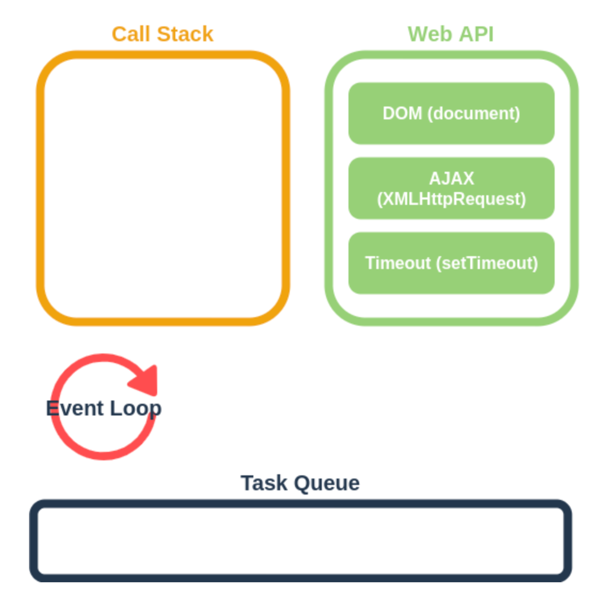

자바스크립트(JavaScript)는 객체(object) 기반의 스크립트 언어입니다

자바스크립트는 본래 브라우저를 제어하는 언어였으나, Node.js라는 새로운 실행환경과 구글 V8 엔진의 등장으로 자체 어플리케이션을 만들 수 있게 된 언어입니다.

또한 자바스크립트는 명령형, 함수형, 객체지향 프로그래밍이 모두 가능한 멀티 패러다임 언어입니다.

자바스크립트가 가지고 있는 언어적 특징은 다음과 같습니다.

- 자바스크립트는 객체 기반의 스크립트 언어입니다.

- 자바스크립트는 동적이며, 타입을 명시할 필요가 없는 인터프리터 언어입니다.

- 자바스크립트는 객체 지향형 프로그래밍과 함수형 프로그래밍을 모두 표현할 수 있습니다.

- 자바스크립트는 싱글스레드 언어입니다.

## JS를 멀티스레드처럼 사용하는 방법

- 쓰레드 : 한 번에 작업할 수 있는 수

- 싱글 쓰레드 : 한번에 하나의 작업만 가능 → 속도 느림

비동기 방식을 통해 여러개의 작업을 동시에 하는 것 처럼 보이는 멀티 태스킹을 사용한다.
Web API, Callback Queue, Event Loop등을 이용한다.



비동기 방식을 통해 여러개의 작업을 동시에 하는 것 처럼 보이는 멀티 태스킹을 사용한다.
Web API, Callback Queue, Event Loop등을 이용한다.

**Call Stack**: 자바스크립트에서 수행해야 할 함수들을 순차적으로 스택에 담아 처리

**Web API**: 웹 브라우저에서 제공하는 API로 AJAX나 Timeout등의 비동기 작업을 실행

**Task Queue**(Callback Queue): Web API에서 처리된 것 넘겨받은 Callback 함수를 저장

**Event Loop**: Call Stack이 비어있다면 Task Queue의 작업을 Call Stack으로 옮김

```jsx
console.log("맨 처음 실행");
setTimeout(() => console.log("async console 1초후 실행"), 1000);
console.log("이건 언제 실행?");
```

1. 맨 처음에는 console.log("맨 처음 실행") 가 Call Stack에 쌓이는데, 이건 바로 실행되어 제거된다.

2. setTimeout이 Call Stack에 쌓인다. setTimeout이 실행되면 Web API에서 Timeout(Node.js에는 Timers)이 timer를 생성한다.

3. console.log("이건 언제 실행?") 이 Call Stack에 쌓이고 바로 실행되고 제거된다.

4. Web API에서 생성된 timer는 생성된 시점을 기준으로 최소 1초 후에 Task Queue(=Callback Queue)로 콜백을 전달한다.

5. Event Loop가 Call Stack에 스택이 없는 것을 확인하면, setTimeout의 콜백함수를 Call Stack으로 호출시킨다.

6. Call Stack에 불러온 콜백함수가 실행된다.
