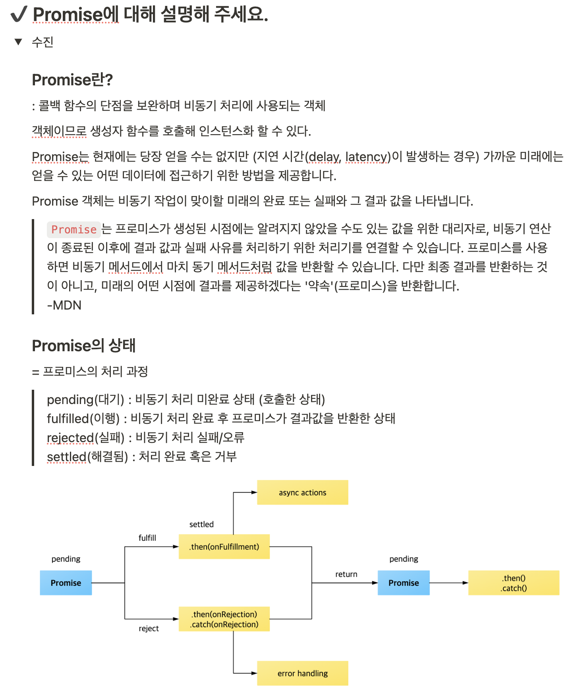

# 2024-1-FE

#### 프론트엔드 학습 내용 공유 레포지토리입니다

#### 구글 미트를 활용하여 학습을 진행하며, 매 회차마다 3~4개의 주제를 선정하여 관련 자료를 찾고 함께 토의한 후 노션에 정리합니다

***

### 노션 정리 예시



***  

### 참여 인원

김수진, 이동욱

***

### 레포지토리 관리 방식

각자의 폴더에 `.md` 또는 `.mdx` 형식으로 공부한 내용을 요약합니다.

main 브랜치에 Pull Request(PR)를 생성하고, 지정된 리뷰어가 정리한 내용을 검토한 후에 병합합니다.

```
.
├── .github/
│   ├── workflow/
│   │   └── review.yml
│   └── auto_assign.yml
├── Dongwook/
│   └── ...
└── Sujin/
    └── ...
```
